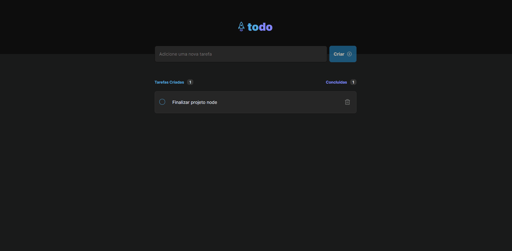
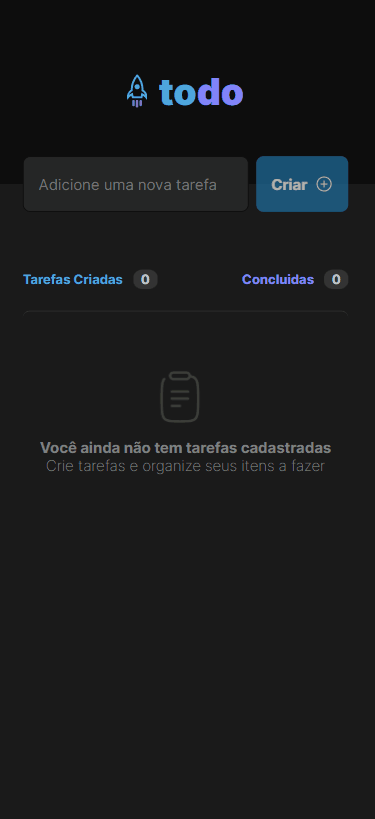

    

<h1 align="center" >To-do List</h1 >

<h2 style="" >Tabela de Conteúdo</h2>

<ul>
   <li><a href="#tabela">Tabela de Conteúdo</a></li>
   <li><a href="#sobre">Sobre</a></li>
   <li><a href="#demonstração">Demonstração</a></li>
   <li><a href="#tecnologias">Tecnologias</a></li>
   <li><a href="#requisitos">Requisitos</a></li>
   <li><a href="#licença">Licença</a></li>
   <li><a href="#autor">Autor</a></li>
   <li><a href="#contato">Contato</a></li>
</ul>

 

# Sobre

Projeto desenvolvido junto ao curso ignite da <a target="_blank" href="https://www.rocketseat.com.br/">Rocketseat💜</a>, basicamente consiste em um organizador de tarfas onde o usuário pode adicionar uma tarefa marcar se concluída ou até mesmo apagar a tarefa.

Futuras verções iremos colocar controle de usário e integração com Api, pois atualemnte está funcionando junto do localStorage para armazenamento de dados.

 

 <a target="_blank" href="https://todo-montanari.onrender.com/">Click Aqui para acessar a aplicação</a> 

# Demonstração

Desktop

 

Mobile

 

# Tecnologias

<ul>
   <li>
    <a target="_blank" href="https://vitejs.dev/">Vite</a>

   </li>
      <li>
      <a target="_blank" href="https://www.npmjs.com/">Npm</a>
    </li>
   
   <li>
        <a  target="_blank"href="https://www.typescriptlang.org/">TypeScript</a>

   </li>

</ul>

 

# Requisitos

<ul>
   <li>Possuir Node.js versão LTS instalada</li>
   <li>Possuir NPM instalado (normalmente vem junto ao node.js)</li>
   <li>Seguir os passos abaixo</li>

  

      #clone este repositório
      $ git clone <https://github.com/montanari2019/to-doList>

      # Acesse a pasta do projeto no terminal/cmd
      $ cd to-doList

      # Instale as dependências com o comando
      $ npm install

      # Execute a aplicação em modo de desenvolvimento
      $ npm run dev

      # Servidor ira executar na porta indicada - acesse <http://localhost: porta indiciada/>

</ul>

# Licença

Distribuído sob a licença MIT. Veja <code>LICENSE</code> para mais informações.

# Autor

Ikaro Montanari, entusiasta por tecnologia e desenvolvedor front-end

Formado em Análie e Desenvolvimento de Sistemas pelo IFRO em Vilhena-RO

# Contato

Linkedin <a target="_blank" href="https://www.linkedin.com/in/ikaro-montanari-5aa120208/">Ikaro Montanari</a> 

Instagram  <a target="_blank" href="https://www.instagram.com/ikaro_montanari/">@ikaro_montanari</a> 

Telefone <a target="_blank" href="https://api.whatsapp.com/send?phone=5569993569547&text=Ol%C3%A1%20ikaro">(69) 99356-9547</a> 

